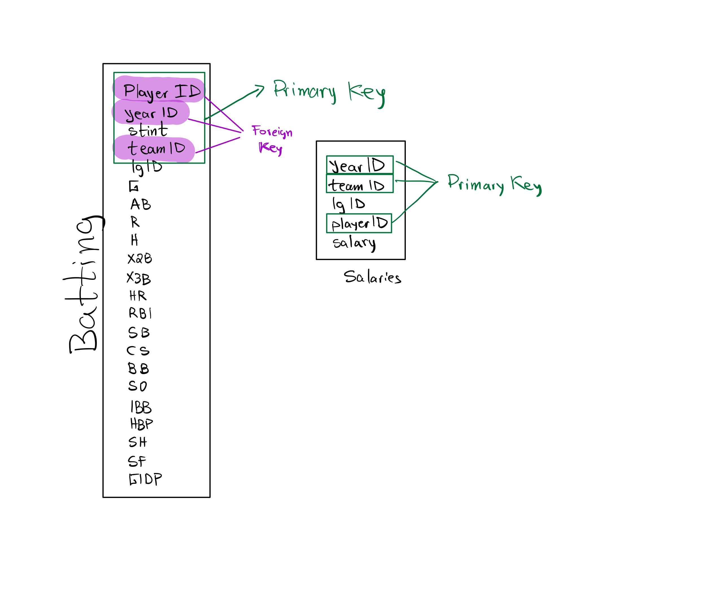

```{r}
library(tidyverse)
library(nycflights13)
library(Lahman)
library(babynames)
library(fueleconomy)
library(nasaweather)
```

# Pregunta 1

Imagina que quieres dibujar la ruta de cada avión desde su origen a su destino. ¿Qué variables necesitarías y qué tablas deberías combinar?

```{r}
flights %>% 
  select(tailnum,origin, dest)
```

# Pregunta 2

- ¿Qué relaciones existen entre las tablas weather y airports? ¿Qué claves son las que se relacionan entre ambas tablas?

```{r}
# Se realacionan "faa" y "origin"
airports %>% 
  left_join(weather, by = c("faa" = "origin"))
```

- weather solo contiene información de los aeropuertos de origen de NYC. Si contuviera información meteorológica de todos los aeropuertos de Estados Unidos, qué relación adicional tendríamos que definir entre esta tabla y flights?

Resp: Tendríamos que realacionar la variable destino de la tabla flights.


- Algunos días del año son especiales (festivos como el 4 de Julio en América) y menos personal suele volar. ¿Cómo indicaríamos esta información como tabla en forma de data frame? ¿Cuáles serían sus claves primarias y cómo se relacionaría la nueva tabla con las ya existentes del dataset de vuelos?

```{r}
flights %>% 
  filter(month == 7, day == 4) -> july4

flights %>% 
  semi_join(july4)
```

- Inventa una clave sustituta para el dataset de vuelos.

# Pregunta 3
Identifica las claves de los siguientes datasets de R (puede que te falten algunos paquetes así que instálalos antes):

- Lahman::Batting

```{r}

#Las claves primarias son: 
Batting %>% 
  count(playerID, teamID, yearID, stint) %>% 
  filter(n>1)
```

- babynames::babynames

```{r}
babynames %>% 
  count(name, sex, year) %>% 
  filter(n>1)
```

- fueleconomy::vehicles

```{r}
# La columna id es el identificador único de cada vehículo
vehicles %>% 
  count(id) %>% 
  filter(n>1)
```
- ggplot2::diamonds

```{r}
diamonds %>% 
  count(carat, cut, table, price, clarity, color, depth, x,y,z) %>% 
  filter(n>2)
```

- nasaweather::atmos

```{r}
atmos %>% 
  count(lat, long, year, month) %>% 
  filter(n>1)
```

# Pregunta 4

- Dibuja un diagrama que muestre las interrelaciones entre las tablas Batting, Master y Salaries del paquete Lahman.


```{r}
Lahman::Salaries %>% 
  count(yearID, teamID, playerID) %>% 
  filter(n>1)
```


- Dibuja otro diagrama que muestre las interrelaciones entre las tablas Master, Managers y AwardsManagers del mismo.

La tabla Master no se encuentra.

 ¿Cómo caracterizarías la relación existente entre las tablas Batting, Pitching y Fielding?


# Pregunta 5

Calcula el retraso promedio por destino. Luego haz un join con el dataset de airports para mostrar información espacial de los retrasos. Pinta un mapa con puntos proporcionales al retraso por cada destino (recuerda usar los parámetros size o colour para mostrar el retraso promedio de cada aeropuerto).

```{r}
flights %>% 
  group_by(dest) %>% 
  summarise(mean_delay = mean(dep_delay, na.rm = TRUE)) %>% 
  inner_join(airports, by = c(dest = "faa")) -> mean_dest_delay

mean_dest_delay %>% 
  ggplot(aes(lon, lat))+
  borders("state")+
  geom_point(aes(col = mean_delay))+
  coord_quickmap()
```

# Pregunta 6
- Añade la localización del origen y destino (latitud y longitud) al dataset de vuelos.

```{r}
locations <- airports %>% 
  select(faa, lat, lon)

flights %>% 
  select(year, month, day, hour, origin, dest) %>%
  left_join(locations, by = c("origin" = "faa")) %>% 
  left_join(locations, by = c("dest" = "faa"), suffix = c(".origin", ".dest"))
```

- Investiga si existe alguna relación entre la edad del avión y sus retrasos (utiliza algún gráfico de ggplot).

```{r}
# Primero filtramos por edad y cola del avión.

plane_age <- planes %>% 
  select(tailnum, plane_year = year)

# Hacemos un inner_join de vuelos con plane_age filtrando por tailnum

plane_data <- flights %>% 
  inner_join(plane_age, by = "tailnum") %>% 
  # Hacemos un mutate para calcular la edad 
  mutate(age = year - plane_year) %>% 
  # Filtramos por los que no son NA
  filter(!is.na(age)) %>% # Nos cargamos 5306 Observaciones de age con NA
  group_by(age) %>% 
  #Calculamos algunos estadísticos
  summarise(
    dep_delay_mean = mean(dep_delay, na.rm = TRUE),
    arr_delay_mean = mean(arr_delay, na.rm = TRUE)
  ) %>% 
  arrange(desc(age))

```

```{r}
plane_data %>% 
  ggplot(aes(age,dep_delay_mean, 
             col = dep_delay_mean)) +
  geom_point()+
  geom_smooth()
```
```{r}

# Según este gráfico la mayor cantidad de retrasos se concentran 
# cuando el avión llega a 10 años.

plane_data %>% 
  ggplot(aes(age,arr_delay_mean, col = arr_delay_mean)) +
  geom_point()+
  geom_smooth()
```


- ¿En qué condiciones meteorológicas es más probable encontrar un retraso de avión?

Por encima de 0.02 pulgadas de precipitación ya podemos notar una clara tendencia en el aumento del retraso.

```{r}
# Hacemos un inner_join entre flight y weather
# Filtrando por origin, year, month, day y hour.

flights %>% 
  inner_join(weather,
             by = c(
               "origin" = "origin",
               "year" = "year",
               "month" = "month",
               "day" = "day",
               "hour" = "hour"
             )) %>% 
  # Agrupamos por precipitaciones
  group_by(precip) %>% 
  summarise(delay = mean(dep_delay, na.rm = TRUE)) %>% 
  # Graficamos
  ggplot(aes(precip, delay)) +
  geom_point(aes(col = precip)) +
  geom_line()+
  geom_smooth()
```


- ¿Qué ocurrió el 13 de Junio de 2013? Representa la distribución de retrasos espaciales y luego usa Google para encontrar alguna referencia del tiempo ese día.

Hubo una gran serie de tormentas (derechos) en el sureste de los EE. UU. (consulte la serie derecho del 12 y 13 de junio de 2013). 

```{r}
flights %>%
  filter(year == 2013, month == 6, day == 13) %>%
  group_by(dest) %>%
  summarise(delay = mean(arr_delay, na.rm = TRUE)) %>%
  inner_join(airports, by = c("dest" = "faa")) 
```


# Pregunta 7
- ¿Qué significa que un vuelo no tenga tailnum? ¿Qué significan los números de cola de los vuelos que no aparecen en la tabla planes? Con una variable o dos debería bastarte para responder.

Son vuelos que no tienen cola tampoco tienen hora de llegada, por lo tanto deben ser cancelados.

```{r}
flights %>%
  select(tailnum, arr_time) %>% 
  filter(is.na(tailnum)) %>% 
  summary()
```


- Filtra los vuelos para mostrar solo los aviones que han volado más de 100 veces en el año.


```{r}
flights %>% 
  filter(!is.na(tailnum)) %>% 
  group_by(tailnum) %>% 
  count() %>% 
  filter(n>=100)
```


- Encuentra en el dataset de vuelos las 48 horas de todo el año que han tenido más retrasos. Cruza la información con la tabla del tiempo weather para explicar lo sucedido. ¿Observas algún patrón?

```{r}
peores_horas <- flights %>%
  mutate(hora = sched_dep_time %/% 100) %>%
  group_by(origin, year, month, day, hour) %>%
  summarise(atraso_salida = mean(dep_delay, na.rm = TRUE)) %>%
  ungroup() %>%
  arrange(desc(atraso_salida)) %>%
  slice(1:48)

clima_peores_horas <- semi_join(weather, peores_horas, 
                                  by = c("origin", "year", "month", "day", "hour"))

select(clima_peores_horas, temp, wind_speed, precip) %>%
  print(n = 48)

ggplot(clima_peores_horas, aes(x = precip, y = wind_speed, color = temp)) +
  geom_point()
```


- ¿Qué nos indica la operación anti_join(flights, airports, by = c("dest"="faa"))?
- ¿Qué nos indica la operación anti_join(airports, flights, by = c("faa"="dest"))?
- ¿Crees que cada avión pertenece a una sola aerolínea? Esa es mi intuición. Confirma o rechaza esta
hipótesis con las herramientas que te he enseñado en esta última sección.

# Pregunta 8
Combina las tablas de fueleconomy::vehicles con fueleconomy::common para encontrar los registros de los coches más comunes.